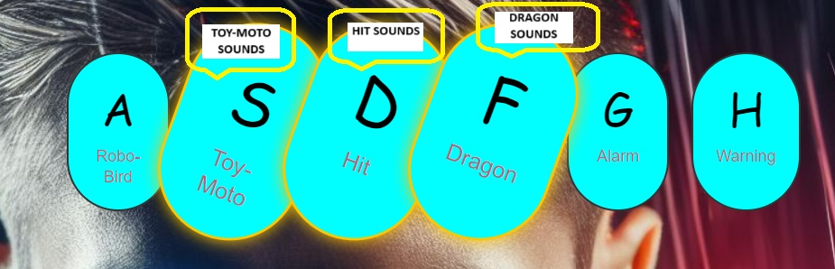

# DRUM-KİT
* This project is a drum-kit project with keyboard action
* The output of the code is as follows on the web page

---

> The main purpose of the project is to show which key is pressed with animation when the keys are pressed and to make the sound written under the keys when that key is pressed. likes below



***Note that the animation should be undone after the key is pressed for a pleasing look***


```javascript 

  1. const keys=document.querySelectorAll('.key')

  2.  keys.forEach(key=>key.addEventListener('transitionend',removeTransition))

  3.function removeTransition(e) {
      if(e.propertyName!=='transform') return;
      this.classList.remove('playing');
     }

```